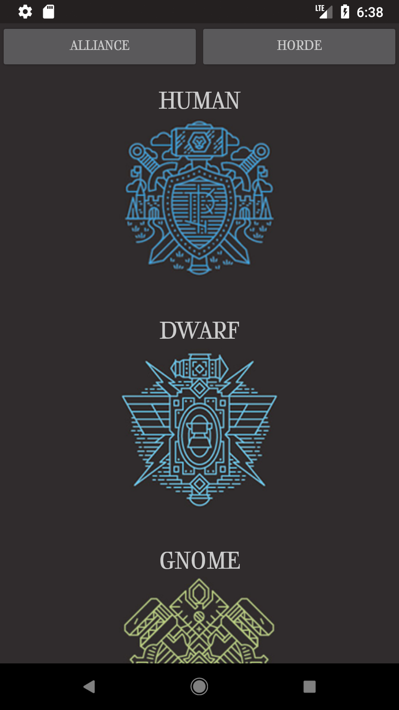
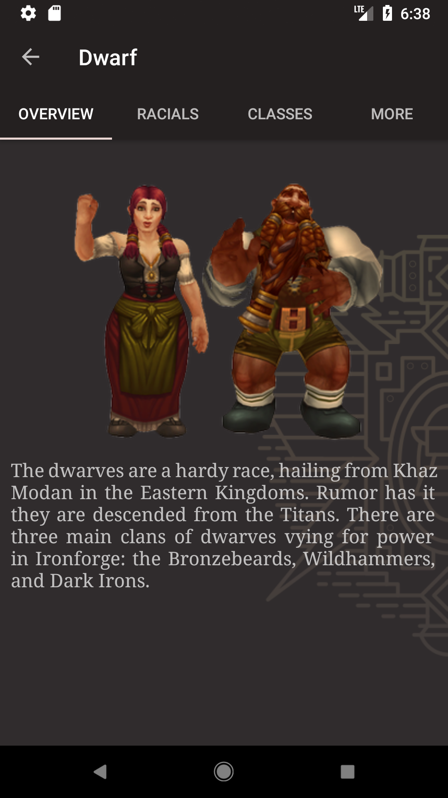
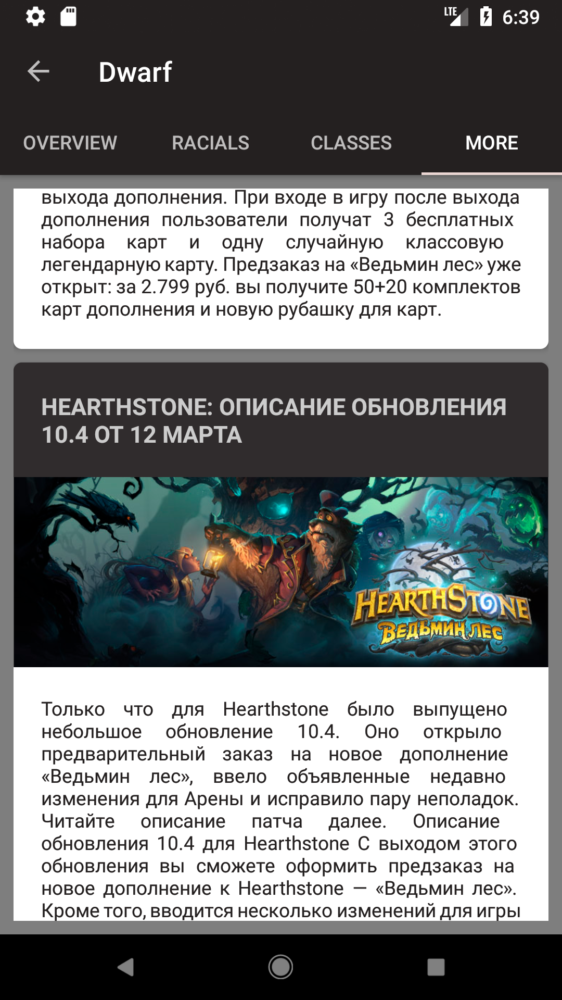

# WoW Races
This is an app I have created to study Android App Development and Java.  
It displays information about World of Warcraft Races.  
New features are being added as I learn new things.  
 
Choose alliance or horde races: 
</img> 
Get info about the race: 
</img> 
Learn what classes are available for this race: 
(Uses recyclerview and cardview with custom adapter getting data from database) 
</img> 
For now the "More" tab displays last 10 articles from <a href="http://www.noob-club.ru/">noob-club</a>: 
(using jsoup parser and picasso for image loading) 
</img> 
 
Race and class monoweight logos by <a href="https://dcmjs.com/">dcmjs</a> 
Copyrights: Blizzard, noob-club.ru

